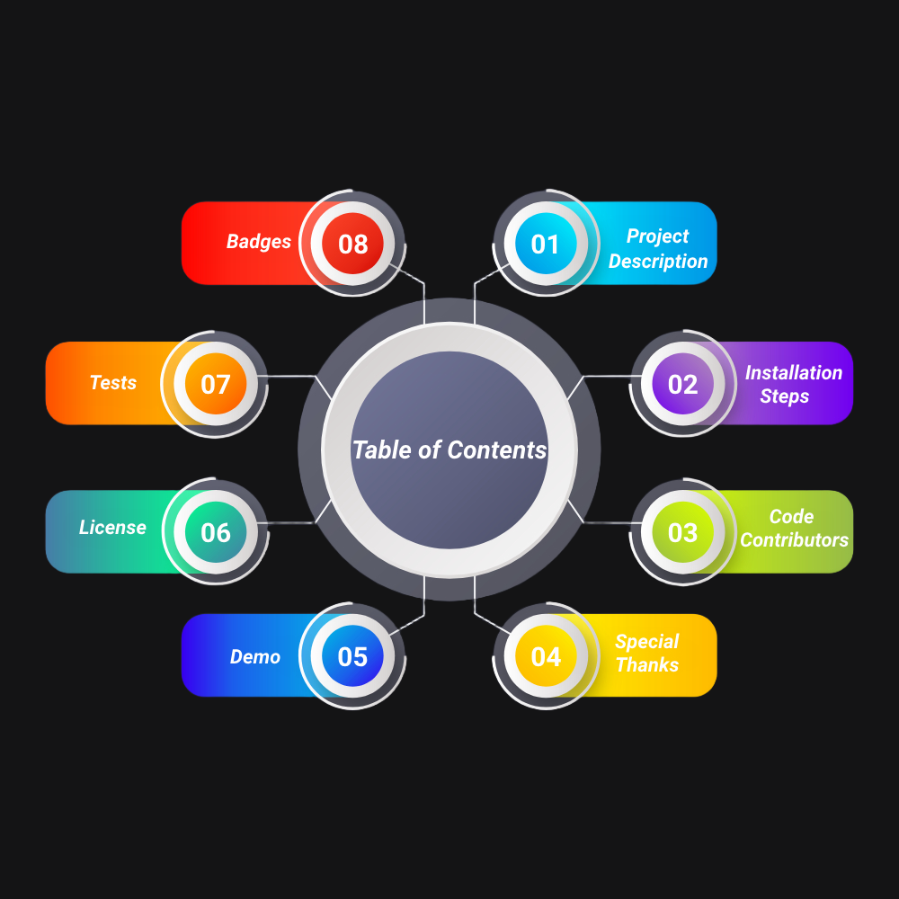

<h1 align="center" style="background-color: white; color: green; padding: 10px; border-radius: 5px; font-weight: bold; font-family: 'Arial', sans-serif;">
   
  <span style="font-family: 'Helvetica Neue', Helvetica, Arial, sans-serif;">RoofMarket</span> 
</h1>


## 🔭 *1. Project Description*
*RoofMarket 🏠 is a modern web platform designed to revolutionize the way people interact with the real estate market. Whether you’re a property owner looking to list your property or a buyer searching for your dream home, RoofMarket simplifies the entire process. With a clean, user-friendly interface and a robust backend, it empowers users to effortlessly browse, manage, and transact properties.*

- ### *What Does RoofMarket Do?*
*Connects property owners with potential buyers or tenants through an intuitive property listing system.
Provides search and filter tools to help users quickly find properties that match their preferences.
Allows property owners to manage their listings, availability, and inquiries in real-time.
Enhances the property browsing experience with dynamic, visually appealing layouts and responsive design.*
- ### *Technologies used*
<p align="center"> </a> <a href="https://www.linux.org/" target="_blank" rel="noreferrer">  </a> <a href="https://www.python.org" target="_blank" rel="noreferrer">  </a> <a href="https://www.mysql.com/" target="_blank" rel="noreferrer">  </a> <a href="https://www.nginx.com" target="_blank" rel="noreferrer">  </a> <a href="https://getbootstrap.com" target="_blank" rel="noreferrer">  </a> <a href="https://git-scm.com/" target="_blank" rel="noreferrer">  </a> <a href="https://www.w3schools.com/css/" target="_blank" rel="noreferrer">  </a> <a href="https://www.w3.org/html/" target="_blank" rel="noreferrer">  </a> <a href="https://developer.mozilla.org/en-US/docs/Web/JavaScript" target="_blank" rel="noreferrer">  </a>  </p>


*We used Linux as the operating system for its stability, Python (Flask) for its simplicity in building scalable web applications, and MySQL for efficient data management. Nginx serves as the web server, while Bootstrap, HTML5, CSS3, and JavaScript enable a responsive, dynamic, and interactive front-end experience. Git helps with version control throughout development.*
## 🛠️ *2. Installation Steps*

*1. Clone the repository*

```bash
git clone https://github.com/antoineleno/alx_finale_porfolio.git
```

*2. Change the working directory*

```bash
cd alx_finale_porfolio
``` 

*3. Create a virtual environment*

```bash
python3 -m venv myenv
```
*4. Activate the virtual environment*

```bash
source myenv/bin/activate
```

*5. Install dependencies*

```bash
pip install -r requirements/requirements.txt
```
*6. Set up the database*
```bash
sudo mysql -u root -p < requirements/database_setup.sql
```
*7. Set up the trigger for subcription management*
```bash
sudo mysql -u root -p < requirements/subcription.sql
```

*8. Change the working directory and Run the app*

```bash
cd web_flask; python3 app.py
```

🌟 You are all set!


## 📘  *How to use this project*
*After completing the installation steps, an admin, supplier and client users will be created with the following credentials :*
> - ***email***&nbsp;: *rmarketadmin@gmail.com*
> - ***password*** : *roofmarketpassword*

> - ***email***&nbsp;: *supplier@gmail.com*
> - ***password*** : *supplierpassword*

> - ***email***&nbsp;: *client@gmail.com*
> - ***password*** : *clientpassword*

## 👯 *3. Code Contributors*

<p align="center">
  <a href="https://github.com/antoineleno/final_porfolio/graphs/contributors">
    
    
  </a>
</p>

> ### 📫 *How to reach us*
<p align="center">
  <strong>Antoine LENO</strong> &nbsp;&nbsp;&nbsp;&nbsp; <strong>Amadou BAH</strong><br>
  <a href="mailto:lenoantoine2000@gmail.com">
      </a>
    <a href="https://github.com/antoineleno">
      </a>
  <a href="https://instagram.com/antoineleno7" target="_blank">
    
  </a>
  &nbsp;&nbsp;&nbsp;&nbsp;&nbsp;&nbsp;
  <a href="mailto:bamadodu634@gmail.com">
    </a>
    <a href="https://github.com/Amadou001">
      </a>
  <a href="https://instagram.com/amadou4176" target="_blank">
    
  </a>
</p>

## 🎯 *Roles and Contributions*

| **Contributor**           | **Role**                  | **Contributions** |
|---------------------------|---------------------------|-------------------|
| **Antoine LENO**      | Backend Developer         | Backend Developer – APIs, Authentication & Real-Time Features <br> &nbsp;&nbsp;• Created user profile management for updating personal info <br>&nbsp;&nbsp;&nbsp;&nbsp;&nbsp;and viewing property subscriptions.<br> &nbsp;&nbsp;•  Implemented subscription payment functionality, allowing <br>&nbsp;&nbsp;&nbsp;&nbsp;&nbsp;users to securely pay for property subscriptions.<br> &nbsp;&nbsp;• Built an API for processing transactions, managing property <br>&nbsp;&nbsp;&nbsp;&nbsp;&nbsp;payments and statuses.<br> &nbsp;&nbsp;• Built the admin panel, enabling administrators to manage user <br>&nbsp;&nbsp;&nbsp;&nbsp;&nbsp;accounts, property listings, and transactions.<br> &nbsp;&nbsp;• Created the user wishlist, allowing users to save and track their <br>&nbsp;&nbsp;&nbsp;&nbsp;&nbsp;preferred properties.<br> &nbsp;&nbsp;• Built an API for processing transactions, managing property <br>&nbsp;&nbsp;&nbsp;&nbsp;&nbsp;payments and statuses.<br> &nbsp;&nbsp;• Integrated real-time messaging with Socket.IO for instant user <br>&nbsp;&nbsp;&nbsp;&nbsp;&nbsp;communication on property inquiries.<br> &nbsp;&nbsp;• Developed authentication, ensuring secure user login, <br>&nbsp;&nbsp;&nbsp;&nbsp;&nbsp;registration, and session management.|
| **Amadou BAH**      | Backend Developer         | Backend Developer – Property Management & Search Functionality <br> &nbsp;&nbsp;• Developed property display features, enabling users to view<br>&nbsp;&nbsp;&nbsp;&nbsp;&nbsp;detailed property listings.<br> &nbsp;&nbsp;•  Implemented search functionality for users to easily find<br>&nbsp;&nbsp;&nbsp;&nbsp;&nbsp;properties based on keywords.<br> &nbsp;&nbsp;• Developed property filtering system to refine search results by<br>&nbsp;&nbsp;&nbsp;&nbsp;&nbsp;criteria such as location, price, and type.<br> &nbsp;&nbsp;• Created supplier-specific views, enabling property suppliers to manage and monitor their listings. <br> &nbsp;&nbsp;• Created the user wishlist, allowing users to save and track their <br>&nbsp;&nbsp;&nbsp;&nbsp;&nbsp;preferred properties.<br> &nbsp;&nbsp;• Built an API for processing transactions, managing property <br>&nbsp;&nbsp;&nbsp;&nbsp;&nbsp;payments and statuses.<br> &nbsp;&nbsp;• Integrated real-time messaging with Socket.IO for instant user <br>&nbsp;&nbsp;&nbsp;&nbsp;&nbsp;communication on property inquiries.<br> &nbsp;&nbsp;• Developed authentication, ensuring secure user login, registration, <br>&nbsp;&nbsp;&nbsp;&nbsp;&nbsp;and session management.|

## 🙇 *4. Special Thanks to*

- [*ALX Software Engineering*](https://www.alxafrica.com/where-did-the-alx-software-engineering-programme-go/)  *for providing us with an incredible training experience.*
- [*Mastercard Foundation*](https://mastercardfdn.org/)  *for generously funding this transformative training opportunity.*
- [*Holberton Inc*](https://www.holbertonschool.com/)  *for their collaboration in powering this exceptional learning journey.*


## 🚀 *5. Demo*

<p align="center">
  <a href="https://youtu.be/y6Zy2TKRKfA?si=f8gd-rbLxdsMEwVi" target="blank">
    
  </a>
</p>


## 📜 *6. License*
*Please refer to the included license file in the repository for detailed information.*

## ✅ *7. Tests*
*Run the following command from the root of the project directory to execute all tests and verify the software functionality :*
```bash
cd; cd alx_finale_porfolio;python3 -m unittest discover tests
```

## 🏅 *8. Badge*
<p align="center">
  <a href="https://github.com/antoineleno/alx_finale_porfolio/blob/main/LICENSE" target="blank">
    
  </a>
  <a href="https://github.com/antoineleno/alx_finale_porfolio/fork" target="blank">
    
  </a>
  <a href="https://github.com/antoineleno/alx_finale_porfolio/stargazers" target="blank">
    
  </a>
  <a href="https://github.com/antoineleno/alx_finale_porfolio/issues" target="blank">
    
  </a>
  <a href="https://github.com/antoineleno/alx_finale_porfolio/pulls" target="blank">
    
  </a>
  <!-- Example Contribution Badge -->
  <a href="https://github.com/antoineleno/alx_finale_porfolio/graphs/contributors" target="blank">
    
  </a>
</p>


